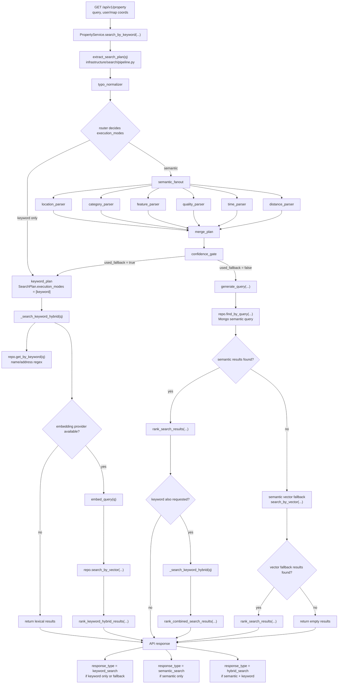

# Search and Recommendation Flow

## Scope

This document describes how the current project implements search and recommendation for properties, with a focus on the keyword-based search flow exposed by `GET /api/v1/property` and the geospatial nearby flow exposed by `GET /api/v1/property/nearby`.

The goal of the feature is not full-text retrieval in the search-engine sense. The current implementation is closer to an AI-assisted structured filter pipeline:

1. Interpret a natural-language query.
2. Convert it into a MongoDB filter.
3. Apply optional geographic proximity.
4. Sort matching documents by internal rating.
5. Fall back to a simple keyword lookup only when the search plan explicitly requests it.

## Main Entry Points

### `GET /api/v1/property`

This is the main search endpoint.

Accepted query parameters:

- `query`: natural-language search text.
- `user_lat`, `user_lng`: current user location.
- `map_lat`, `map_lng`: map center location.

Response shape:

- `status`
- `preferences`: UI-oriented tags extracted from the query
- `results`: property overview objects

### `GET /api/v1/property/nearby`

This endpoint is a pure geospatial search and does not use the LLM intent parser. It filters by distance from a point and optionally by frontend `category`, which the backend expands into one or more Google Places `primary_type` values.

### `POST /api/v1/property`

This endpoint is part of the data ingestion path rather than the runtime search path. It fetches Google Place data, generates AI analysis, and persists the normalized property document that later participates in search and recommendation.

## High-Level Architecture

The feature spans four layers:

- API layer: receives request parameters and returns response DTOs.
- Application layer: orchestrates query understanding, repository lookup, and fallback behavior.
- Enrichment layer: uses Google Gemini / Vertex AI to interpret user intent and to enrich place data.
- Persistence layer: stores and queries `PropertyEntity` documents in MongoDB.

Relevant files:

- `interface/api/routes/v1/property.py`
- `application/property.py`
- `application/property_search/ranking.py`
- `application/property_search/rules.py`
- `domain/services/property_enrichment.py`
- `infrastructure/search/pipeline.py`
- `infrastructure/search/prompts.py`
- `infrastructure/google/__init__.py`
- `infrastructure/mongo/property.py`
- `domain/entities/property.py`
- `domain/entities/enrichment.py`
- `infrastructure/google/vertex.py`
- `infrastructure/google/place_api.py`

## Runtime Search Flow

The current runtime path is easiest to read as a route-selection flow. The API may now return:

- `semantic_search`: semantic execution only
- `keyword_search`: keyword execution only, or semantic fallback to keyword
- `hybrid_search`: semantic and keyword both ran for the same query

### 1. HTTP request enters the property route

`GET /api/v1/property` receives the free-text query plus two optional coordinate sources:

- user location
- map center

The route forwards them to `PropertyService.search_by_keyword(...)`.

Important detail: the route now normalizes coordinates before calling the service. If either latitude or longitude is missing, that coordinate source is treated as unavailable instead of building a partially empty geo tuple.

### 2. Natural-language query is converted into a structured intent

`PropertyService.search_by_keyword(...)` calls:

- `enrichment_provider.extract_search_plan(q)`

The concrete implementation is `GoogleEnrichmentProvider.extract_search_plan(...)`, which uses the LangGraph-based search pipeline defined in `infrastructure/search/pipeline.py`.

The pipeline produces a structured `SearchPlan` containing:

- `execution_modes`: whether the query should run keyword retrieval, semantic retrieval, or both
- `filter_condition`: the normalized `PropertyFilterCondition`
- `semantic_extraction`: summarized address/category/feature/quality/time extraction
- `warnings`: low-confidence parsing signals
- `used_fallback` and `fallback_reason`

### 3. Intent generation rules

The prompt strongly constrains the model to avoid common mistakes.

#### Type mapping

Natural-language category words are mapped to `primary_type` values, for example:

- coffee / dessert / afternoon tea -> `cafe`
- hot pot -> `hot_pot_restaurant`
- restaurant -> `restaurant`
- lodging / hotel -> `lodging`
- vet / doctor -> `veterinary_care`
- pet grooming -> `pet_care`
- pet supplies -> `pet_store`
- park / hiking / dog park -> `park`

#### Address vs. landmark separation

The prompt explicitly forbids putting POI keywords such as `Taipei 101` or `Sun Moon Lake` into `address` regex filters unless the term is clearly an administrative district or street name.

The intended rules are:

- district / road -> `address` regex
- landmark / attraction -> `landmark_context`
- “near me” -> `landmark_context = CURRENT_LOCATION`

#### Feature filters

Pet-related requirements should map to boolean fields under `ai_analysis.pet_features`, not to free-text search.

This means recommendation quality depends heavily on the AI enrichment done at ingestion time.

#### Rating triggers

The system uses `min_rating` as a coarse recommendation gate.

The neutral default is now `0.0`. Rating filters are only added when the parsed intent explicitly asks for recommendation-oriented quality thresholds.

#### Time-sensitive opening filters

Opening-time phrases are handled by a dedicated time node instead of being folded into generic `is_open=true`.

Examples of the current rule-based behavior:

- `現在有開` -> open now
- `下午有開的` -> open during today's afternoon window
- `晚上有開的` -> open during today's evening window
- `禮拜五開的` -> open at some point on Friday

These queries are converted into `op_segments` overlap filters so the system can reason about specific time windows rather than only "open right now".

### 3.1 Currently Supported Natural-Language Phrases

The current search pipeline supports the following common query shapes:

- direct lookup: `肉球森林`
- ambiguous lookup plus category: `寵物公園`
- landmark search: `青埔咖啡廳`, `台北101附近咖啡廳`
- address search: `台北咖啡廳`, `中壢區 咖啡廳`
- feature search: `可落地的咖啡廳`, `不用推車的餐廳`, `有寵物餐`
- recommendation search: `推薦的店`, `評價好的咖啡廳`
- open-now search: `現在有開的`, `營業中的咖啡廳`
- weekday opening search: `禮拜五開的咖啡廳`
- time-of-day opening search: `下午有開的`, `晚上有開的咖啡廳`
- travel-time search: `步行15分鐘的公園`, `距離30分鐘車程的咖啡廳`

### 4. Final Mongo query is assembled

After the LLM returns a `PropertyFilterCondition`, `generate_query(...)` merges the structured conditions into a final MongoDB filter.

This step:

- starts from `intent.mongo_query`
- adds `rating >= min_rating` when `min_rating > 0`
- preserves explicit opening-window filters on `op_segments` when the query targets a weekday or time-of-day window
- chooses a geographic anchor
- injects a geospatial `location` filter using `$nearSphere`

Geographic anchor precedence is:

1. `CURRENT_LOCATION` -> normalized `user_coords`
2. explicit landmark -> geocode landmark with LLM
3. otherwise -> normalized `map_coords`

If the chosen coordinates are missing or incomplete, the geo filter is skipped.

If landmark geocoding fails, the search now degrades gracefully to a non-landmark query instead of raising an exception.

### 5. MongoDB executes the structured query and the application reranks the results

`PropertyRepository.find_by_query(...)` runs:

- `collection.find(query)`
- `.sort("rating", -1)`

MongoDB still returns a first-pass candidate list ordered by rating, but the application layer now performs a second-pass rerank before returning results.

The current rerank combines:

- AI-derived rating
- overall pet-feature density
- requested pet-feature matches from the query
- distance score when a geo anchor exists
- small bonuses for exact type match and requested open-now match

This is still a heuristic ranker rather than a learned recommendation model, but it is no longer pure `rating desc`.

### 6. Fallback to regex keyword search

If the structured query returns zero documents, the service falls back to `get_by_keyword(q)`.

The fallback query is:

- case-insensitive regex on `name`
- case-insensitive regex on `address`

The service returns all matched results from the keyword lookup, up to the repository limit.

This fallback is important because it allows direct place-name lookup when the intent parser produces filters that are too narrow or too abstract.

## Where Recommendation Signals Come From

The project has two different recommendation stages.

### Stage A: offline-ish enrichment during property creation

When a new property is created through `POST /api/v1/property`, the system:

1. searches Google Places by name
2. fetches place details and reviews
3. sends the combined source data to Vertex AI
4. generates a structured `AIAnalysis`
5. stores the resulting `PropertyEntity`

The stored analysis includes:

- `venue_type`
- `ai_summary`
- `pet_features.rules`
- `pet_features.environment`
- `pet_features.services`
- `highlights`
- `warnings`
- `ai_rating`

This `ai_rating` becomes the document `rating` used later in query-time ranking.

### Stage B: online query-time filtering and sorting

At search time, the runtime system does not regenerate recommendations from reviews. Instead, it reuses the stored enrichment fields:

- `primary_type`
- `ai_analysis.pet_features.*`
- `rating`
- `location`
- `address`

So the search system is recommendation-aware mainly because the database already contains AI-generated pet-friendliness features and ratings.

## Data Model Notes

`PropertyEntity` contains several derived fields that matter for search:

- `location`: generated from longitude/latitude for geospatial search
- `rating`: copied from `ai_analysis.ai_rating`
- `is_open`: computed from opening hours at model-validation time
- `op_segments`: generated from opening hours for open/closed evaluation

This means search behavior depends not only on raw stored data but also on Pydantic model validation side effects.

## Nearby Search Flow

`GET /api/v1/property/nearby` is simpler than keyword search.

It:

- validates `lat` and `lng` as required coordinates
- uses a default `radius=10000`, `page=1`, and `size=20`
- optionally expands frontend `category` into one or more Google Places `primary_type` values
- applies MongoDB `$near` on the stored GeoJSON `location`
- paginates results with `skip` and `limit`
- counts total results using a separate `$geoWithin` filter
- excludes soft-deleted properties through the shared active-record filter
- returns the standard property overview DTO plus `has_note`

This endpoint is proximity-first and recommendation-second. It does not interpret natural language and does not use `preferences` tags.

### Nearby Route Responsibilities

The nearby path stays thin across the same route -> application -> repository layering:

- `interface/api/routes/v1/property.py` validates request params and expands `category` into primary types
- `application/property.py::PropertyService.search_nearby(...)` delegates directly to the repository
- `infrastructure/mongo/property.py::PropertyRepository.get_nearby(...)` owns the geospatial query, pagination, and total counting

This means the route currently contains a small but intentional piece of business-facing translation logic: frontend category enums are converted into the repository-facing Google Places `primary_type` list before the query runs.

### Nearby Request Semantics

The current request contract is:

- `lat`: required latitude
- `lng`: required longitude
- `radius`: optional search radius in meters, default `10000`
- `category`: optional `PropertyCategoryKey`
- `page`: optional page number, default `1`
- `size`: optional page size, default `20`

`category` is not stored directly in MongoDB. The backend looks up the category in `domain/entities/property_category.py` and expands it to the matching `primary_type` list.

Examples of the current mapping behavior:

- `restaurant` includes `restaurant`, `brunch_restaurant`, `bar`, and other restaurant subtypes
- `cafe` includes `cafe`, `coffee_shop`, `dessert_shop`, `bakery`, and `dog_cafe`
- `pet_hospital` includes `veterinary_care`

If no `category` is provided, the query stays distance-only.

### Nearby Query Semantics

The repository currently performs two related MongoDB queries:

1. A `find(...)` query with `location.$near` to fetch the current page of results.
2. A `count_documents(...)` query with `location.$geoWithin.$centerSphere` to compute `total`.

The same query also applies:

- the shared active-record filter `{"is_deleted": {"$ne": True}}`
- an optional `primary_type: {"$in": ...}` filter when category expansion produced types

The endpoint does not currently:

- run the semantic search pipeline
- use LLM-derived `preferences`
- apply rating reranking
- interpret map radius overrides from natural-language queries

MongoDB `$near` determines result ordering, so the returned list is distance-prioritized by the database rather than explicitly sorted by application code.

### Nearby Response Semantics

The response shape is paginated:

- `items`
- `total`
- `page`
- `size`
- `pages`

Each item uses `PropertyOverviewResponse`, which includes:

- `id`
- `name`
- `address`
- `latitude`
- `longitude`
- `category`
- `types`
- `rating`
- `is_open`
- `has_note`

`has_note` is attached in the route after retrieval. If a current user is available, the route asks `PropertyService.get_noted_property_ids(...)` for the returned property IDs and annotates the response items. If no user is available, `has_note` remains `false`.

### Nearby Validation Anchors

The current nearby behavior is pinned mainly by:

- `tests/unit/adapters/fastapi/test_property.py`
- `tests/unit/domain/test_property_category.py`

These tests currently verify:

- category expansion for the nearby route
- category-to-primary-type mappings used by nearby filtering

Repository-level unit coverage for `get_nearby(...)` is still relatively light compared with the keyword-search path, so future behavior changes should add direct tests close to `infrastructure/mongo/property.py` when query semantics change.

## Response Semantics

The keyword search response returns:

- `preferences`: frontend-facing tags that explain how the query was interpreted
- `results`: a list of overview entities

The tags are important because they are the only explicit trace of the system’s intent interpretation shown to the client.

## Current Strengths

- Clear separation between API, application, enrichment, and repository concerns.
- Good use of structured model output instead of free-form LLM text.
- Practical fallback from intent-based search to direct keyword lookup.
- Search is grounded in a normalized property model rather than calling Google live for every query.
- Recommendation logic is specialized for pet-related use cases through `AIAnalysis`.
- The search path now guards against missing coordinate pairs and landmark geocoding failures.

## Current Limitations and Risks

The following issues are still present in the current implementation and should be understood as part of the existing behavior.

### 1. Ranking is heuristic, not learned

The ranking layer now blends multiple signals, but it is still a hand-tuned heuristic formula. It does not yet use click feedback, popularity history, or learned relevance signals.

### 2. Search quality depends heavily on prompt behavior

The query parser is strongly guided by prompt rules, which is practical, but it also means regressions can be introduced by prompt drift or model behavior changes unless the project maintains regression tests around expected parsed intents.

## Suggested Future Improvements

If the team wants the feature to evolve beyond the current implementation, the most impactful next steps would be:

1. Tune the heuristic weights with real query examples instead of keeping them static.
2. Add more regression coverage around query parsing outputs, not just query assembly safeguards.
3. Separate intent extraction from ranking strategy so recommendation tuning does not require prompt tuning.
4. Add popularity or engagement signals once the project has usable behavioral data.

## Summary

The current search and recommendation feature is best described as an AI-assisted MongoDB filtering system backed by AI-enriched property metadata.

Its recommendation quality depends on two things:

- how well the ingestion pipeline converts Google place data and reviews into `AIAnalysis`
- how well the query parser converts natural language into correct MongoDB filters

At runtime, recommendation is implemented primarily through:

- structured filtering
- optional geospatial narrowing
- heuristic reranking over rating, pet-friendly signals, and distance
- regex fallback when structured search fails

That design is pragmatic and understandable, but it is still an early-stage recommendation system rather than a fully developed ranking engine.
