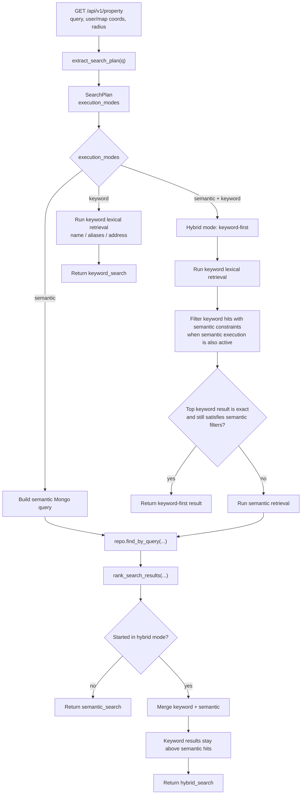
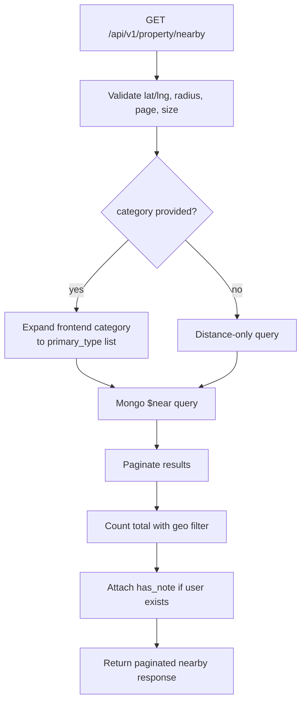

# Search Overview Guide

## Purpose

This guide explains the current search and recommendation flow in a human-oriented way.

Use it when you want to understand the big picture before reading implementation details.

## When To Read This Doc

Read this document when:

- onboarding to the search feature
- explaining the flow to another developer or stakeholder
- understanding why a query became keyword, semantic, hybrid, or nearby
- you want diagrams and examples before reading the agent-facing docs

Read `docs/search/architecture.md` for the agent-facing structural boundaries and `docs/search/workflow-optimization.md` for execution rules when changing search behavior.

## Diagram

### Main Search Flow

### Nearby Search Flow

## Walkthrough

The current search system is closer to an AI-assisted structured filter pipeline than to a traditional full-text search engine.

The main flow works like this:

1. The API receives a natural-language query.
2. The search planner decides whether the query should run keyword search, semantic search, or both.
3. Semantic search turns the query into structured filters.
4. Keyword search looks for direct lexical matches in name, aliases, and address.
5. Hybrid mode tries keyword first, then runs semantic retrieval only when needed.
6. The final response returns one of `keyword_search`, `semantic_search`, or `hybrid_search`.

Important examples of supported query shapes:

- direct lookup: `肉球森林`
- ambiguous lookup plus category: `寵物公園`
- landmark search: `青埔咖啡廳`
- address search: `中壢區 咖啡廳`
- feature search: `可落地的咖啡廳`
- recommendation search: `評價好的咖啡廳`
- open-now or time-window search: `現在有開的`, `晚上有開的咖啡廳`
- travel-time search: `步行15分鐘的公園`

The nearby endpoint is intentionally simpler. It does not use the LLM search planner. It validates coordinates, expands the frontend category when present, runs a MongoDB geospatial query, and returns distance-prioritized results.

Recommendation quality comes from two stages:

1. Property creation stores AI-enriched metadata such as pet features and AI rating.
2. Runtime search reuses those stored fields to filter and rank results.

That means search quality depends on both ingestion-time enrichment and query-time interpretation.

## Related Agent Docs

- `docs/search/architecture.md`
- `docs/search/workflow-optimization.md`
- `docs/search/workflow-nearby.md`
