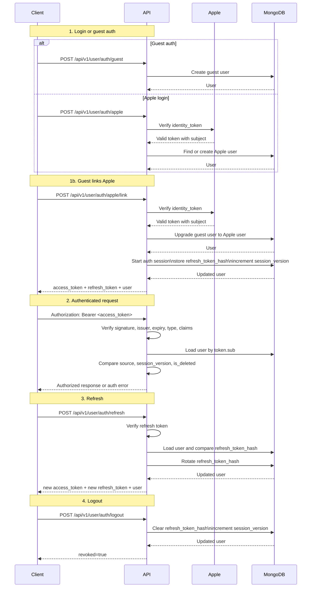

# Auth Sequence Guide

## Purpose

This guide explains the current user authentication flow in a human-oriented way.

Use it when you want a quick walkthrough of guest auth, Apple login, Apple linking, authenticated requests, refresh, and logout before reading the implementation-oriented docs.

## When To Read This Doc

Read this document when:

- onboarding to the current auth model
- explaining the login and session flow to another developer or stakeholder
- you want diagrams before reading the agent-facing architecture and workflow docs
- you need a quick mental model of how backend-issued auth differs from Apple identity verification

Read `docs/user/architecture.md` for the agent-facing structure and boundaries, and `docs/user/workflow-account-lifecycle.md` for implementation and validation rules.

## Diagram

## Walkthrough

The current auth system has two stages that are easy to confuse if they are read together too quickly:

1. Identity verification
2. Backend session authentication

For `guest` users, the backend creates a user directly during guest auth.

For `apple` users, the backend first verifies the Apple `identity_token`, then uses the verified Apple `sub` to find, create, or restore the matching user.

For guest users who later link Apple, the backend verifies the Apple identity and upgrades the same user record in place before issuing a new session.

After either path succeeds, the backend starts its own auth session. From that point on, normal API requests no longer use the original Apple credential. They use backend-issued bearer tokens instead.

Authenticated requests work in two steps:

1. Verify the bearer token itself.
2. Re-check persisted user state such as `source`, `session_version`, and soft-delete status.

That second step is important. A token can look structurally valid but still fail if the stored user has been deleted, logged out, or replaced by a newer session version.

Refresh keeps the same session version and rotates only the stored refresh token hash. Logout clears the stored refresh token hash and increments `session_version`, which invalidates older access tokens without needing an access-token blacklist.

## Related Agent Docs

- `docs/user/architecture.md`
- `docs/user/workflow-account-lifecycle.md`
